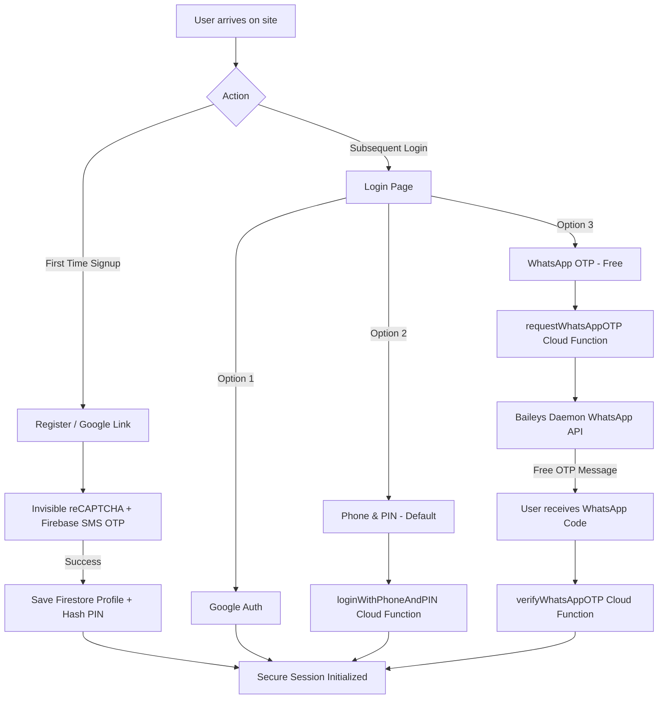

# 🙏 OM NAMAH SHIVAY SHIVJI SADA SAHAY 🙏
# 🙏mOM NAMAH SHIVAY GURUJI SADA SAHAY 🙏
# JAI GURUJI MAHARAJ 🌸

# Guruji Satsang Management App

Welcome to the **Guruji Satsang Management App**, a devotee-centric digital platform designed to unite the Sangat under the divine blessings of Guruji Maharaj. 

This app serves as a centralized hub for devotees to discover local Satsangs, register attendance, volunteer for spiritual Sevas (selfless service roles), and coordinate with hosts. For organizers and administrators, it provides robust management tools to coordinate logistics, approve attendee requests, assign seva roles, and broadcast messages to the Sangat.

---

## 📖 Table of Contents
1. [🌟 Introduction (For Sangat members)](#-introduction-for-sangat-members)
2. [🧭 Key Modules & Views](#-key-modules--views)
3. [🔑 Authentication Architecture (Technical)](#-authentication-architecture-technical)
4. [🛠️ Technical Stack & Client Architecture](#%EF%B8%8F-technical-stack--client-architecture)
5. [⚙️ Standalone WhatsApp Daemon](#%EF%B8%8F-standalone-whatsapp-daemon)
6. [📊 Cloud Firestore Collections Schema](#-cloud-firestore-collections-schema)
7. [⚡ Cloud Functions Reference](#-cloud-functions-reference)
8. [💻 Local Development & Setup](#-local-development--setup)
9. [🚀 Deployment & Configuration Guide](#-deployment--configuration-guide)
10. [⚙️ Administrative Operations](#%EF%B8%8F-administrative-operations)

---

## 🌟 Introduction (For Sangat members)

The Guruji Satsang App is designed with simplicity, devotion, and community in mind, allowing the Sangat to participate in Satsangs with ease. 

### What can you do as a Devotee?
* **Find Satsangs Near You**: Use the interactive map and search filters (by city or postcode) to discover upcoming spiritual gatherings in your area.
* **Register Attendance**: Easily request spots for yourself, family members, and friends. The app automatically manages capacities and waitlists for over-subscribed Satsangs.
* **Volunteer for Seva**: Offer your assistance in various sacred roles (e.g., Langar preparation, Darbar decoration, AV setup, and Langar distribution) directly from the Satsang details page.
* **Stay in Touch**: Receive automated confirmation emails and announcement broadcasts from hosts and administrators.
* **Devotional Bani & Guidelines**: Access Satsang conduct discipline guides and read Guruji's divine Vachans (quotes) daily.

---

## 🧭 Key Modules & Views

The platform consists of several integrated frontend views that route dynamically via a zero-dependency hash router (`#/home`, `#find`, `#profile`, etc.):

### 1. Home Module (`HomeView.jsx`)
* **Divine Vachans Quote Translator**: Displays a randomly selected quote from Guruji's Divine Vachans, showing Punjabi text and its English translation.
* **Quick View**: Displays the top 3 nearest upcoming Satsangs based on estimated location.
* **Swaroops Gallery**: Displays a beautiful grid of Guruji's sacred Swaroops (photographs).

### 2. Search & Proximity Module (`FindView.jsx`)
* **Interactive Map**: Integrates a Leaflet-based map displaying upcoming Satsangs and global Sangat Hub locations.
* **Proximity Calculation**: Sequentially orders Satsangs from nearest to farthest based on your coordinates (estimated via timezone / IP geolocation or manually typed postcode/city).

### 3. Detail & Registration Module (`DetailView.jsx`)
* **Logistics Info**: Displays detailed Satsang timings, host contact information, addresses, and navigation routes.
* **RSVP Form**: Allows devotees to enroll themselves and their profile-registered family guests.
* **Organizer Dashboard**: Allows hosts to approve/decline RSVPs, manage the waitlist, and assign or decline volunteers for Seva slots.

### 4. Hosting Module (`PostView.jsx`)
* **Step-by-Step Hosting**: A clean form to schedule a new Satsang, specify attendee limits, and define what Seva roles are needed.
* **Address Validation**: Integrates Google Address Validation with OpenStreetMap Nominatim coordinate fallback, automatically extracting accurate latitude and longitude coordinates.

### 5. Profile & Guest Settings (`ProfileView.jsx`)
* **Devotee Settings**: Devotees can update their personal information, manage family members/regular guests (specifying if they are children aged 10 or younger), and update their 6-digit account PIN.

### 6. Satsang Dashboard (`DashboardView.jsx`)
* **Sangat Summary**: Displays devotee statistics, including active Sevas and total hosted/attended Satsangs.
* **Timeline Views**: Groups user participation into "Satsangs I'm Hosting", "Satsangs I'm Attending", and "Concluded Satsangs".

### 7. Admin Panel (`AdminView.jsx`)
* **Sangat Registry**: Admin audits of registered Sangat profiles, user role management (assigning host or admin roles), and mail broadcasts.

### 8. Guidelines Module (`GuidelinesView.jsx`)
* Displays the spiritual conduct and disciplines required of the Sangat when attending a Satsang (maintaining silence, disabling mobile phones, etc.).

---

## 🔑 Authentication Architecture (Technical)

To align with a tight operating budget and eliminate recurring carrier SMS gateway costs (which are expensive in regions like India and the UK), the application operates on a hybrid **Tri-Mode Authentication System**. 

SMS OTP verification is restricted **strictly to first-time registration and profile completion** (once per user lifecycle), while routine logins use free alternatives.

### 1. The Tri-Mode Authentication Flows



#### A. Registration & Profile Completion Flow
1. **Manual Registration**:
   * User enters their profile details, phone number, and a secure 6-digit numerical PIN.
   * Clicking "Verify & Register" displays an **intermediate pre-verification confirmation modal**:
     > [!NOTE]
     > *"We will send a one-time verification SMS to: [Phone Number]. Please confirm you can access this phone's SMS inbox right now to complete registration..."*
   * This modal lets users fix typos before triggering the carrier charges. Clicking "Send" mounts the invisible reCAPTCHA container (`#recaptcha-container-register`) and triggers Firebase Auth `signInWithPhoneNumber`.
   * User verifies the SMS code. The frontend calls `registerUserWithPhoneAndPIN` Cloud Function, which hashes the PIN using SHA-256 on the backend and writes the Firestore profile under a Phone UID.
2. **Google Profile Completion**:
   * If a user signs up via Google and lacks a profile, a stateful guard in `App.jsx` intercepts the session and redirects them to the registration page.
   * If Google provides a pre-verified phone, the step is skipped. If not, they must enter their phone and complete the SMS OTP step.
   * Successful SMS verification triggers client-side `linkWithCredential` to map the phone credentials directly to their Google UID, and the PIN is hashed and saved.
3. **Background Auth Sync**:
   * Firestore triggers (`onUserCreated` and `onUserUpdated`) sync the user's phone number to their Firebase Auth credentials on the backend. This enables subsequent logins using Phone + PIN or WhatsApp OTP under the same original Google UID, preventing account fragmentation.

#### B. Phone & PIN Login (Default Tab)
* Devotees enter their phone number and 6-digit PIN.
* The frontend hashes the PIN client-side (SHA-256) and calls the `loginWithPhoneAndPIN` Cloud Function.
* The backend verifies the hash against Firestore `pinHash` and returns a secure Firebase Custom Auth Token to sign the user in.

#### C. WhatsApp OTP Login (Secondary Tab)
* Devotees enter their phone number and click request code.
* Handled by the `requestWhatsAppOTP` Cloud Function, which calls our self-hosted WhatsApp daemon to send an OTP code.
* **Spam-Resistant Rotation**: The function rotates between **10 spiritually respectful message templates** to vary message signatures, bypassing automated Meta spam detection.
* **Anti-Enumeration Guard**: If an unregistered phone requests an OTP, the backend immediately returns a success payload without doing DB writes or triggering WhatsApp. The frontend displays the code verification input normally. This prevents malicious harvesting of the sangat directory.
* Verifying the OTP is handled by `verifyWhatsAppOTP` (limited to 3 attempts). On success, it issues a Custom Auth Token.

---

## 🛠️ Technical Stack & Client Architecture

### 1. Frontend Client
* **Framework**: React.js (Vite compiler).
* **Styling**: Vanilla CSS with custom-tailored dark-burgundy (`#1a0800`), gold (`#d4972a`), and saffron (`#e06b10`) variables, featuring premium Outfit and Inter typography.
* **Routing**: Native Hash Routing (`window.location.hash`) preventing hosting rewrite complexity.
* **Service Worker**: Cache-Bypassing `sw.js` combined with a self-healing client listener (`index.html`) that instantly clears browser caches and forces a hard-reload if chunk compilation hash conflicts are detected (preventing stale brown-screen lockouts).

### 2. Client Self-Healing Cache Gateway
To eliminate browser caching lockouts (where users see a blank screen when assets are rebuilt), a dual-layered self-healing architecture is used:
1. **Hard Bypass in Service Worker**: `public/sw.js` completely bypasses caching for root `/` and `/index.html` requests, ensuring the client always downloads the latest compiled asset hashes.
2. **Client HEAD Listener**: Inside the HTML `<head>`, a capturing error handler captures stylesheet/script load failures and unhandled dynamic import rejections. If an asset fails to load, it automatically unregisters all service workers, clears storage caches, and hard-reloads the page:
   ```js
   window.addEventListener('error', function(e) {
     if (e.target && (e.target.tagName === 'SCRIPT' || e.target.tagName === 'LINK')) {
       // Clear caches & reload...
     }
   }, true);
   ```

---

## ⚙️ Standalone WhatsApp Daemon

Located under `tools/whatsapp-sender/`, this is a lightweight node server that hosts the free sending gateway:

* **Core**: Built on `@whiskeysockets/baileys` (multi-device WebSockets connection to WhatsApp Web API) and Express.js.
* **Authentication**: Authorized calls are protected by a shared bearer token configured in your Cloud Functions settings.
* **Session Persistence**: Caches credentials inside `auth_info_multi/` to preserve session authentication. It prints a scanable QR code inside the terminal window on startup for initial pairing.
* **Endpoints**:
  * `POST /send-otp`: Sends the customized template message to target numbers.
  * `GET /status`: Returns connection states (connected, connecting, closed).

---

## 📊 Cloud Firestore Collections Schema

### `/users/{uid}`
Stores Sangat profiles, role configurations, guest settings, and hashed credentials.
```json
{
  "name": "Devotee Name",
  "email": "devotee@example.com",
  "phone": "+919999999999",
  "address": "123 Darbar Street",
  "city": "London",
  "postcode": "EC1A 1BB",
  "role": "user | host | admin",
  "pinHash": "sha256_hashed_6_digit_pin",
  "guests": [
    {
      "id": "guest_uuid",
      "name": "Family Guest Name",
      "age": 8,
      "isChild": true
    }
  ],
  "createdAt": "Timestamp",
  "updatedAt": "Timestamp"
}
```

### `/satsangs/{satsangId}`
Stores scheduled Satsang logistics, required Seva roles, and capacities.
```json
{
  "title": "Weekly Devotional Satsang",
  "date": "2026-06-15",
  "time": "17:00",
  "address": "123 Darbar Street",
  "city": "London",
  "postcode": "EC1A 1BB",
  "latitude": 51.5074,
  "longitude": -0.1278,
  "description": "Satsang description and instructions...",
  "maxAttendees": 50,
  "attendeeCount": 12,
  "status": "upcoming | completed | cancelled",
  "organizerUid": "host_user_uid",
  "organizerName": "Host Name",
  "organizerEmail": "host@example.com",
  "organizerPhone": "+447777777777",
  "sevas": {
    "s1": {
      "id": "s1",
      "needed": 4,
      "opted": 2,
      "enrolled": [
        { "uid": "devotee_uid", "name": "Devotee Name", "attendeeUid": "devotee_uid" }
      ]
    }
  },
  "createdAt": "Timestamp",
  "updatedAt": "Timestamp"
}
```

### `/satsangs/{satsangId}/attendees/{userId}`
Tracks RSVPs, attending group counts, waitlist standings, and requested Sevas.
```json
{
  "userUid": "devotee_uid",
  "userName": "Devotee Name",
  "userEmail": "devotee@example.com",
  "userPhone": "+919999999999",
  "status": "pending | confirmed | waitlisted",
  "guests": 2,
  "attendeesList": [
    { "id": "devotee_uid", "name": "Devotee Name", "isPrimary": true },
    { "id": "guest_uuid", "name": "Family Guest Name", "isPrimary": false }
  ],
  "requestedSevas": [
    {
      "sevaId": "s1",
      "personId": "devotee_uid",
      "personName": "Devotee Name",
      "status": "pending | confirmed | declined"
    }
  ],
  "registeredAt": "Timestamp",
  "confirmedAt": "Timestamp"
}
```

### `/otps/{phone}`
Temporary storage for WhatsApp OTP verification codes.
```json
{
  "code": "123456",
  "attempts": 0,
  "createdAt": "Timestamp",
  "expiresAt": "Timestamp"
}
```

---

## ⚡ Cloud Functions Reference

All functions are written in Node.js 20 and deployed to the `europe-west2` region:

| Function Name | Type | Description |
|---|---|---|
| `onUserCreated` | Firestore trigger | Syncs phone number to auth user; sends an Outfit-styled welcome email with Guruji's Swaroop (`public/guruji-01.jpg`) and a random Vachan quote. |
| `onUserUpdated` | Firestore trigger | Syncs updated user details (e.g. phone number changes) to their Firebase Authentication profile. |
| `onAttendanceRegistered` | Firestore trigger | Dispatches email confirmations/pending notices when an RSVP is submitted. |
| `checkSatsangCapacity` | Firestore trigger | Dispatches an alert email to the host when RSVPs reach 100% capacity. |
| `onSatsangCancelled` | Firestore trigger | Automatically emails all registered attendees when a Satsang is cancelled. |
| `dailyReminder` | PubSub Cron | Runs daily to send reminders to attendees of Satsangs scheduled for the following day. |
| `autoCompleteSatsangs` | PubSub Cron | Runs daily to update past Satsangs' status to `completed`. |
| `checkPhoneAvailability` | Https Callable | Checks if a phone number is already registered in Firestore (enforces uniqueness). |
| `registerUserWithPhoneAndPIN` | Https Callable | Creates manual users, hashes their PIN using SHA-256, and returns a Custom Auth Token. |
| `loginWithPhoneAndPIN` | Https Callable | Validates Phone & PIN hashes, issuing a Custom Auth Token. Includes anti-enumeration. |
| `updateUserPIN` | Https Callable | Updates the logged-in user's Firestore `pinHash` securely. |
| `requestWhatsAppOTP` | Https Callable | Dispatches OTP to registered users using Baileys and rotates templates to avoid spam blocks. Includes anti-enumeration. |
| `requestWhatsAppOTPForRegistration`| Https Callable| Dispatches WhatsApp OTP for unregistered numbers during registration. |
| `verifyWhatsAppOTP` | Https Callable | Validates the WhatsApp login code (max 3 tries) and issues a Custom Auth Token. |
| `registerUserWithWhatsAppOTP` | Https Callable | Validates registration OTP, hashes PIN, and registers user or completes Google profile. |
| `migrateUserProfileToPhoneUID` | Https Callable | Securely migrates Google profiles, Satsangs, RSVPs, and Sevas from Google UIDs to unified Phone UIDs on the backend using Admin SDK privileges. |
| `sendBroadcast` | Https Callable | Allows admin users to broadcast email updates to the entire Sangat list. |

---

## 💻 Local Development & Setup

### Prerequisites
* Node.js (v20 or v22 recommended).
* Firebase CLI installed: `npm install -g firebase-tools`

### 1. Clone & Install Dependencies
```bash
# Clone the repository and install frontend dependencies
npm install

# Install Cloud Functions dependencies
cd functions && npm install

# Install WhatsApp daemon dependencies
cd ../tools/whatsapp-sender && npm install
```

### 2. Configure Local Environment
Create a `.env` file inside `tools/whatsapp-sender/`:
```env
PORT=3001
API_SECRET=your_shared_secret_token
```

Configure your Firebase Cloud Functions environment variables locally (or using the CLI for deployment):
```bash
npx firebase functions:config:set whatsapp.url="http://localhost:3001" whatsapp.secret="your_shared_secret_token"
```

### 3. Run the Servers
```bash
# Start the Vite development server (runs on Port 3000)
npm run dev

# Start the local WhatsApp daemon (runs on Port 3001)
cd tools/whatsapp-sender && npm start
```
*When starting the WhatsApp daemon, scan the QR code printed in the terminal with your WhatsApp Mobile App to pair the server.*

---

## 🚀 Deployment & Configuration Guide

### 1. Register OAuth & Whitelist Redirect URIs
If you are deploying to a custom domain (e.g., `gurujisatsangs.com`):
1. Go to **Google Cloud Console** → **APIs & Services** → **Credentials**.
2. Select your OAuth 2.0 Client ID.
3. Under **Authorized redirect URIs**, add your custom domain OAuth handler:
   `https://gurujisatsangs.com/__/auth/handler`
4. Set the `authDomain` configuration in `src/firebase/config.js` to `gurujisatsangs.com`.

### 2. Restrict Google API Key Permissions
To secure your Firebase Client API Key, ensure it is restricted in the Google Cloud Console. The key requires permissions for the following APIs:
* **Cloud Firestore API**
* **Firebase Authentication API**
* **Geocoding API** (Required for address resolving in `PostView`)
* **Maps JavaScript API** (Required for the interactive leaflet map integration)
* **reCAPTCHA Enterprise API** (Required for Firebase Phone Auth invisible reCAPTCHA checks)

### 3. Deploy to Firebase Staging / Production
```bash
# 1. Build the production client bundle
npm run build

# 2. Set SMTP credentials for notifications (Gmail App Passwords)
npx firebase functions:config:set email.user="youraddress@gmail.com" email.pass="your-16-char-app-password"

# 3. Configure production WhatsApp daemon URL & Secret
npx firebase functions:config:set whatsapp.url="https://your-daemon-domain.com" whatsapp.secret="your_shared_secret"

# 4. Deploy database rules and indexes
npx firebase deploy --only firestore --project your-project-id

# 5. Deploy Cloud Functions (deploys in europe-west2)
npx firebase deploy --only functions --project your-project-id

# 6. Deploy frontend assets
npx firebase deploy --only hosting --project your-project-id
```

---

## ⚙️ Administrative Operations

### 1. Provisioning Admin Access
1. Open the **Firebase Console** → **Firestore Database**.
2. Navigate to the `users` collection and locate the user document by UID or email.
3. Add or modify the `role` field value, setting it to `"admin"`.
4. The user will now see the **⚙ Admin** panel when logging in.

### 2. Composition of broadcasts
Admins can navigate to the Admin page, compose a notification title and body, and broadcast the announcement. The backend will batch-email the notice to every registered devotee's inbox.

---

## 🙏 Shukrana Guruji
This application was built with love, devotion, and selfless service (Seva) to help the Sangat stay connected under Guruji's blessings.

*OM NAMAH SHIVAY GURUJI SADA SAHAY* 🙏
